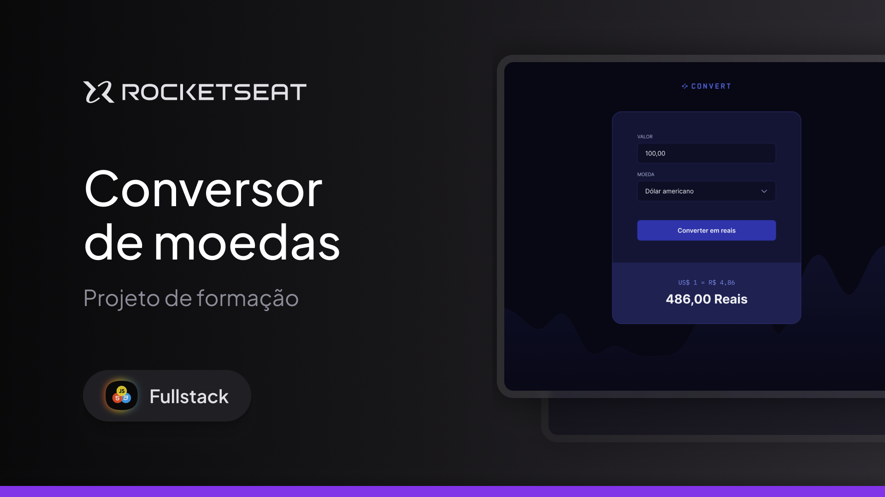

# Projeto - Conversor de moedas

<picture>
  <source media="(prefers-color-scheme: dark)" srcset="img/Thumbnail-md.png">
  <source media="(prefers-color-scheme: light)" srcset="img/Thumbnail-md.png">
  
</picture>

### Aplicação desenvolvida com:

|Tecnologias                              | 
|---------------------------------------|
|  ✔ HTML                   |  
|  ✔ CSS   |  
|  ✔ JavaScript   |  

### Objetivo da aplicação
- Converter valor da moeda para reais(BRL) baseado na
quantidade inserida pelo usuário.

### Moedas convertidas
- BRL (Real Brasileiro)
- USD (Dólar Americano)
- € (Euro)
- £ (Libra Esterlina)

